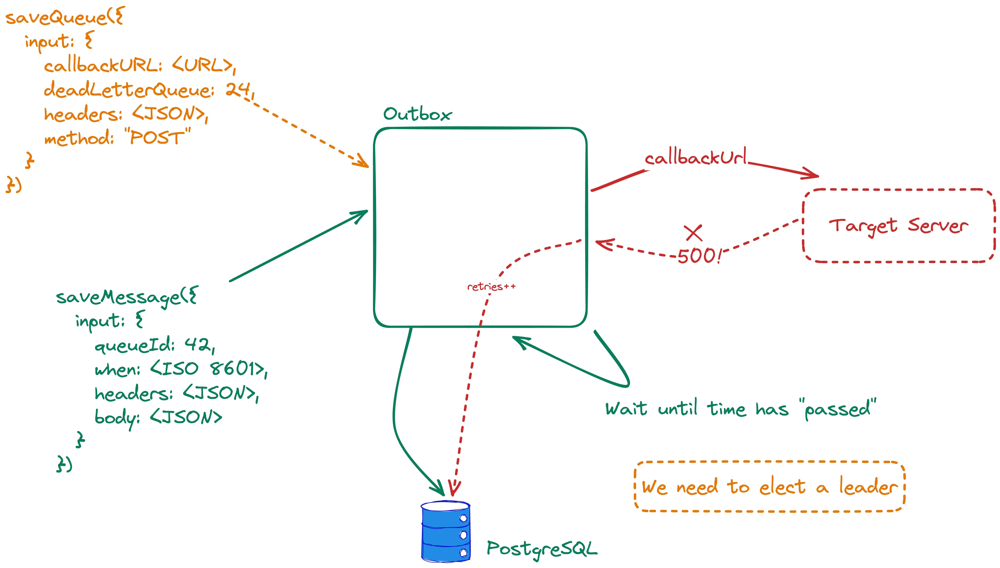

# unscalable-queue-system

Tiny Queue System that will call your service back
after a given time.

## TODO

* [x] support multiple content-types
* [x] add tests for callbacks in the future
* [x] implement at-least-once semantics / retry if target fails
* [x] cron job capability / repeat
* [x] authorization
* [x] Dead letter endpoint
* [x] implement batching (call endpoints in parallel)
* [ ] 100% code coverage
* [x] Split plugin.js into multiple files
* [ ] Refactor tests so that there is little repetition

## License

Apache 2.0
